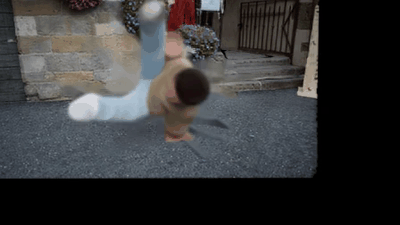
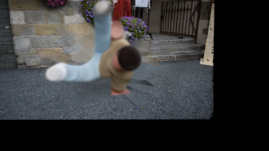
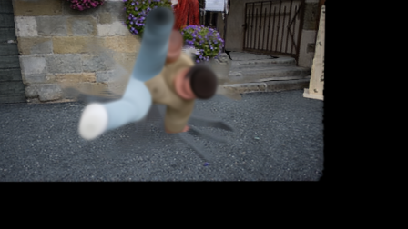
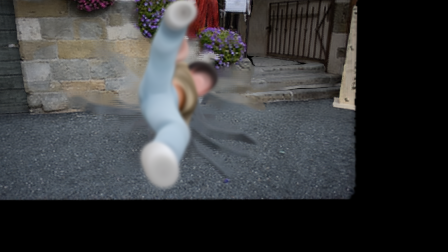

# FreeView4D

**Monocular video → navigable 4D Gaussian Splatting world** via static/dynamic decomposition. No per-scene optimization. Runs on consumer GPUs (tested on RTX 4060 8 GB).

<p align="center">
  
  
</p>
<p align="center"><em>Left: fixed camera, time advances through the dance. Right: camera orbits <strong>while</strong> time advances.</em></p>

## What this does

Given a short video of a scene with one (or more) moving object(s) on a largely static background, FreeView4D produces a **4D scene** you can navigate in **both space and time**:

- **Static part** — stone walls, floor, buildings — reconstructed once as a dense 3DGS from the clean (person-inpainted) frames
- **Dynamic part** — moving person, object, limb — extracted as per-frame 3D point clouds that snap into the scene at the correct 3D position at each timestep

The whole pipeline is **feed-forward**, finishes in under a minute per short clip, and requires **zero per-scene optimization**.

## How it works

```
video → SAM2 video → masks per frame
      → cv2 inpaint → person-erased frames
      → WorldMirror(clean frames)   → static 3DGS + cameras + depth
      → WorldMirror(original frames)→ depth + cameras (person visible)
      → unproject(mask × depth)     → per-frame person 3D points
      → gsplat composite            → renderable at any (view, t)
```

See [`docs/architecture.md`](docs/architecture.md) for the design reasoning and comparison to existing 4DGS methods (Shape of Motion, MoSca, Deformable-3DGS).

## Hardware tested

| GPU | VRAM | Status |
|---|---|---|
| RTX 4060 | 8 GB | ✅ works at `target_size=352`, 24 frames |
| RTX 4090 / A100 | 24 GB+ | ✅ works at `target_size=448`, up to ~64 frames |
| RTX 5060 Ti / Blackwell | 16 GB | ⚠️ needs PyTorch nightly with `sm_120` support (WorldMirror's pinned PT 2.4.0 cu124 does **not** include it) |

## Install

Requires **WSL Ubuntu** (or Linux), **Python 3.10**, a **CUDA 12.4 driver or newer**, and **~8 GB disk** for cloned deps and weights.

```bash
git clone https://github.com/NodeNestor/FreeView4D
cd FreeView4D
bash setup/install.sh
```

`install.sh` will:
1. Clone [HY-World 2.0](https://github.com/Tencent-Hunyuan/HY-World-2.0), [SAM2](https://github.com/facebookresearch/sam2), and [MoSca](https://github.com/JiahuiLei/MoSca) (demo data) into `deps/`
2. Create a conda env `freeview4d` with PyTorch 2.4.0 + cu124
3. Install requirements (gsplat, pycolmap, open3d, sam2, ...)
4. Patch WorldMirror's `flash-attn` hard import so it falls back to SDPA (needed unless you also install flash-attn, which is painful on Blackwell / Windows)
5. Download the SAM2.1-tiny checkpoint
6. WorldMirror weights auto-download on first run via `huggingface_hub`

## Quick start — breakdance demo

Runs the full pipeline on the DAVIS breakdance-flare clip (bundled with MoSca), produces `time_only.mp4`, `spacetime.mp4`, and `static_only.mp4`:

```bash
bash scripts/quickstart.sh
```

The outputs land in `output/breakdance_demo/render/`.

## Custom video

```bash
bash scripts/run_pipeline.sh \
    --video path/to/clip.mp4 \
    --output output/my_scene \
    --click_x 480 --click_y 260 \
    --n_frames 16 --target_size 448
```

- `--click_x/y` — one pixel inside the moving object in frame 0 (SAM2 will track from there)
- `--n_frames` — how many frames to subsample from the clip
- `--target_size` — WorldMirror resize dimension (larger = better quality, more VRAM)

See [`examples/CUSTOM_VIDEO.md`](examples/CUSTOM_VIDEO.md) for details.

## Gallery — same scene, three moments in time

<p align="center">
  
  
  
</p>

The stone wall, flowers, door, and cobblestones are **pixel-identical** in all three frames — only the dancer moves. That's the whole point of the decomposition.

## Limitations (honest)

- **Discrete time**: 24 snapshots are not a continuous motion. For smooth in-between rendering, use a motion-basis on top (Shape of Motion, MoSca) — this repo is the input prior that makes those methods converge fast.
- **Dynamic part is a colored point cloud, not a fully-optimized 3DGS.** Close-ups look chunky. A future step is to fit proper Gaussians around the unprojected points.
- **Unseen-region coverage**: if the moving object occludes the same chunk of background in *every* frame, that background is never observed and cv2 inpaint can only go so far. A video-diffusion inpainter (VACE / Wan) would fill these pockets cleanly.
- **Single moving object**: the pipeline assumes one primary dynamic object per scene. Multi-object works but you need one SAM2 click per object.
- **Camera motion must be modest**: WorldMirror's camera estimation is solid for drone-orbit-ish scans but stretches on wild hand-held clips.

## ⚠️ License and Territory

This project integrates several components with different licenses. **Please read before you use or distribute.**

- **Our wrapper code** (everything under `freeview4d/`, `scripts/`, `setup/`, `configs/`) is **Apache 2.0** (see [`LICENSE`](LICENSE)).
- **WorldMirror 2.0 / HY-World 2.0** (Tencent) is under the [Tencent HY-World 2.0 Community License](https://github.com/Tencent-Hunyuan/HY-World-2.0/blob/main/License.txt). This license **excludes the European Union, United Kingdom, and South Korea** from the licensed Territory. If you are in one of those jurisdictions, Tencent has not granted you rights to use HY-World 2.0 under this license.
- **SAM2** (Meta) — Apache 2.0.
- **Shape of Motion, MoSca** (referenced only) — MIT / Apache 2.0.
- See [`NOTICES.md`](NOTICES.md) for a full breakdown.

If you need a fully permissively-licensed stack (including EU/UK/SK), swap the 3D backend: the static/dynamic decomposition architecture here works with any feed-forward multi-view-to-3DGS model. Good alternatives: **[VGGT](https://github.com/facebookresearch/vggt)** (Apache 2.0), **[MASt3R / DUSt3R](https://github.com/naver/mast3r)** (non-commercial research). Replacing the `freeview4d/worldmirror_runner.py` module is all it takes.

## Credits

- **Tencent HY-World 2.0 / WorldMirror** — feed-forward multi-view → 3DGS model the static pass depends on ([github](https://github.com/Tencent-Hunyuan/HY-World-2.0))
- **Meta SAM2** — video segmentation + temporal mask propagation ([github](https://github.com/facebookresearch/sam2))
- **DAVIS** — the breakdance-flare demo clip ([website](https://davischallenge.org))
- **MoSca** (Lei et al., CVPR 2025) — packaged the DAVIS demo we use ([github](https://github.com/JiahuiLei/MoSca))
- **gsplat** — the rasterizer ([github](https://github.com/nerfstudio-project/gsplat))
- **Shape of Motion** (Wang et al., ICCV 2025) and related 4DGS literature — architectural inspiration for the decomposition ([paper](https://shape-of-motion.github.io/))

Powered by Tencent HY. Not affiliated with Tencent, Meta, or any dataset authors.
