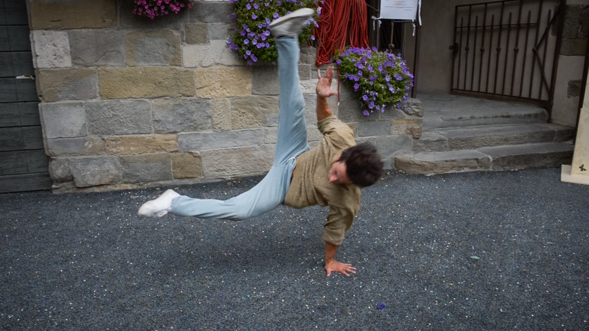
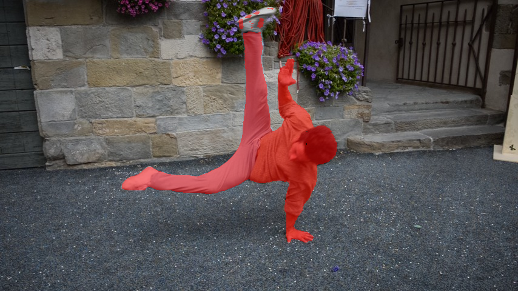

# FreeView4D

<p align="left">
  <a href="LICENSE"></a>
  
  
  
</p>

> 🧪 **Prototype — this is a small demo of an idea, not production software.** It's a working proof of concept that video → navigable 4D scene is achievable *without* per-scene optimization, by decomposing the problem into `static + dynamic(t)` and using off-the-shelf feed-forward models. Rough edges, honest limitations, ~300 lines of glue code.

**Monocular video → navigable 4D Gaussian Splatting world** via static/dynamic decomposition. No per-scene optimization. Runs on consumer GPUs (tested on RTX 4060 8 GB).

<p align="center">
  
  
</p>
<p align="center"><em>Left: fixed camera, time advances through the dance (the static wall/floor/flowers stay pixel-identical; only the dancer moves). Right: camera orbits <strong>while</strong> time advances — navigable in both space and time.</em></p>

## What this is (and isn't)

**Is:** a ~50-second pipeline that takes a short video with one moving thing on a static background and spits out a 4D scene you can render from any viewpoint at any moment in time. The pipeline glues together four existing models ([HY-World 2.0](https://github.com/Tencent-Hunyuan/HY-World-2.0), [SAM 2](https://github.com/facebookresearch/sam2), cv2 inpaint, [gsplat](https://github.com/nerfstudio-project/gsplat)) with one key insight: **if you decompose the scene into static + dynamic, the static part becomes a one-shot feed-forward problem** and the dynamic part is a small per-frame problem — neither needs hours of per-scene optimization like classical 4DGS.

**Isn't:** a finished method. Compared to Shape of Motion or MoSca (full per-scene 4DGS optimization over motion bases), the quality is rougher and time is discrete. See [Limitations](#limitations) and [Future work](#future-work).

## The input → output story

<table>
<tr>
<td align="center"><strong>1. Input frame</strong><br/>monocular video, no camera calibration</td>
<td align="center"><strong>2. SAM2 single-click tracking</strong><br/>one click, auto-propagated across all frames</td>
</tr>
<tr>
<td></td>
<td></td>
</tr>
<tr>
<td colspan="2" align="center"><strong>3. Output: the same scene at three different moments in time</strong><br/>static background is pixel-identical across all three; only the dancer moves</td>
</tr>
<tr>
<td colspan="2" align="center">
  
  
  
</td>
</tr>
</table>

### Static-only reference — no dynamic content, clean background orbit

<p align="center">
  
</p>

Notice there's a **faint patch of slightly-blurrier ground** where the dancer moved through — that's the signature of the cv2 inpainting that erased the person before WorldMirror reconstructed the background. It's not perfect, and a video-diffusion inpainter (see [Future work](#future-work)) would make it indistinguishable from the real floor.

## How it works

```
video → SAM2 video          → masks per frame
      → cv2 inpaint          → person-erased frames
      → WorldMirror(clean)   → static 3DGS + cameras + depth
      → WorldMirror(original)→ depth + cameras (person visible)
      → unproject(mask × depth) → per-frame person 3D points
      → gsplat composite     → renderable at any (view, t)
```

See [`docs/architecture.md`](docs/architecture.md) for the design reasoning, why we run WorldMirror twice, and a comparison table against Shape of Motion, MoSca, Deformable-3DGS, and SpaceTime Gaussians.

## Install

Requires **WSL Ubuntu** (or Linux), **Python 3.10**, a **CUDA 12.4+ driver**, and **~8 GB disk** for cloned deps and weights.

```bash
git clone https://github.com/NodeNestor/FreeView4D
cd FreeView4D
bash setup/install.sh
```

`setup/install.sh` clones HY-World 2.0 / SAM2 / MoSca (demo data) into `deps/`, creates a conda env `freeview4d` with PyTorch 2.4.0 + cu124, patches WorldMirror so flash-attn is truly optional, and downloads the SAM2-tiny checkpoint. HY-World 2.0 weights auto-download on first pipeline run.

## Quick start — breakdance demo

```bash
conda activate freeview4d
bash scripts/quickstart.sh
```

Outputs `time_only.mp4`, `spacetime.mp4`, `static_only.mp4` in `output/breakdance_demo/render/`. Takes ~50 seconds on a 4060.

## Custom video

```bash
bash scripts/run_pipeline.sh \
    --video path/to/clip.mp4 \
    --output output/my_scene \
    --click_x 480 --click_y 260 \
    --n_frames 16 --target_size 448
```

- `--click_x/y` — one pixel inside the moving object in frame 0 (SAM2 tracks from there)
- `--n_frames` — how many frames to subsample from the clip
- `--target_size` — WorldMirror resize dim (larger = better, more VRAM)

See [`examples/CUSTOM_VIDEO.md`](examples/CUSTOM_VIDEO.md) for tips.

## Hardware

| GPU | VRAM | Status |
|---|---|---|
| RTX 4060 | 8 GB | ✅ works at `target_size=352`, 24 frames |
| RTX 4090 / A100 | 24 GB+ | ✅ works at `target_size=448`, ~64 frames |
| RTX 5060 Ti / Blackwell | 16 GB | ⚠️ needs PyTorch nightly with `sm_120` support (WorldMirror's pinned PT 2.4.0 cu124 doesn't include it) |

## Limitations

- **Discrete time** — 16 or 24 snapshots are not a continuous motion. For a smooth intermediate time, the current renderer snaps to the nearest input timestep. [Future work](#future-work) is the fix.
- **Dynamic part is a colored point cloud, not a fully-optimized 3DGS** — close-ups look chunky. Each dynamic pixel is rendered as a small uniform Gaussian.
- **Unseen-region coverage holes** — if the moving object occludes the *same* chunk of background in every frame, that background is never observed and cv2 inpaint can only go so far.
- **Single moving object** — the pipeline assumes one primary dynamic object per scene. Multi-object works with one SAM2 click per object but compositing is not yet wired end-to-end.
- **Camera motion must be modest** — WorldMirror's camera estimation works on drone-orbit-ish scans; wild hand-held gets noisy.
- **This is a prototype** — 300-ish lines of glue. No tests, no CI, no GUI. Expect to poke at the code.

## Future work

Three concrete upgrades that would turn this from a prototype into a useful tool:

1. **Video-diffusion inpainting for coverage holes.** Replace cv2's Telea inpaint with a temporally-consistent video diffusion model ([VACE](https://github.com/ali-vilab/VACE) / [Wan](https://github.com/Alibaba-ZeroSearch/Wan-Video)). For *large* occluded regions (where the moving object covered the same background pixels across many frames), multi-frame diffusion coherently hallucinates what's behind — no more patches of blurry ground in the static pass.

2. **Proper per-frame dynamic 3DGS (or motion-basis model).** The dynamic-object side is currently a point cloud — upgrade paths:
   - **Per-frame 3DGS**: fit optimized Gaussians per frame via a short gsplat optimization on the object crop. Cleaner close-ups.
   - **Motion-basis / canonical + deformation**: drop [Shape of Motion](https://shape-of-motion.github.io/) or [MoSca](https://github.com/JiahuiLei/MoSca) on top of the point clouds we already produce. They take per-frame geometry as input — which is exactly what the current pipeline already outputs. Result: smooth temporal interpolation, proper per-Gaussian trajectories, editable scene graph.

3. **Multi-object scenes.** One SAM2 click per object, one dynamic track per object, compose at render time. ~20-line patch to `freeview4d/sam2_video.py` and `freeview4d/render_4d.py`.

Together these three upgrades move the output from "prototype 4D demo" to "competitive with optimization-based 4DGS methods at a fraction of their compute".

## ⚠️ License and Territory

- **Our wrapper code** (`freeview4d/`, `scripts/`, `setup/`, `configs/`) is **Apache 2.0** (see [`LICENSE`](LICENSE)).
- **HY-World 2.0** (Tencent) — [Tencent HY-World 2.0 Community License](https://github.com/Tencent-Hunyuan/HY-World-2.0/blob/main/License.txt). **Excludes EU, UK, and South Korea** from the licensed Territory.
- **SAM2** (Meta) — Apache 2.0.
- **DAVIS** demo clip — CC BY-NC 4.0 (via MoSca).
- See [`NOTICES.md`](NOTICES.md) for the full breakdown.

For a fully permissively-licensed stack (including EU/UK/SK), swap the 3D backend for **[VGGT](https://github.com/facebookresearch/vggt)** (Apache 2.0) — the static/dynamic decomposition architecture is independent of the specific multi-view-to-3DGS model.

## Credits

- **Tencent HY-World 2.0 / WorldMirror** — feed-forward multi-view → 3DGS ([github](https://github.com/Tencent-Hunyuan/HY-World-2.0))
- **Meta SAM 2** — video segmentation + temporal tracking ([github](https://github.com/facebookresearch/sam2))
- **MoSca** (Lei et al., CVPR 2025) — bundled DAVIS demo clips ([github](https://github.com/JiahuiLei/MoSca))
- **DAVIS** — the breakdance-flare sequence ([website](https://davischallenge.org))
- **gsplat** — the rasterizer ([github](https://github.com/nerfstudio-project/gsplat))
- **Shape of Motion** (Wang et al., ICCV 2025), **MoSca**, and the broader 4DGS literature — architectural inspiration

Powered by Tencent HY. Not affiliated with Tencent, Meta, or any dataset authors.
